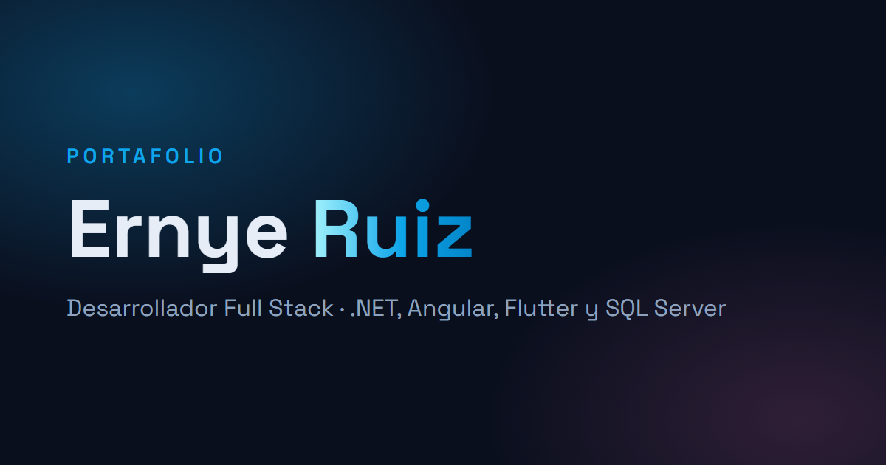

# Portafolio personal

Sitio donde publico mis proyectos, desarrollado con asistencia de Claude Code. Estático, sin base de
datos: cada proyecto es un archivo Markdown y publicar uno nuevo es hacer commit.

**Sitio:** https://portafolio-personal-phi-black.vercel.app ·
[English](https://portafolio-personal-phi-black.vercel.app/en/)

## Lo interesante

- **Bilingüe sin texto en español colado en la versión en inglés.** Los textos de
  la interfaz viven en un diccionario tipado: si al inglés le falta una clave,
  falla `astro check`. El contenido en inglés solo trae los campos traducibles y
  se une al español en el build; si falta una traducción o los textos de la
  galería no cuadran con las capturas, el build falla.
- **Contenido validado.** Cada proyecto se valida con Zod en tiempo de build: un
  campo mal escrito rompe el build, no la página publicada.
- **Estático con una sola función en el servidor.** Todo se genera en el build
  salvo `/api/contacto`, que corre como función serverless. La validación del
  formulario es lógica pura con tests, las claves solo existen en el servidor y
  un honeypot frena a los bots.
- **Rápido por defecto.** Cero JavaScript al navegador salvo donde hace falta
  (galería, visor, menú, formulario) y capturas optimizadas a WebP.
- **SEO por idioma.** `lang`, URL canónica, `hreflang`, `og:locale` y sitemap con
  las dos versiones de cada página.
- **CI.** Cada push y PR corre `check`, `test` y `build`.

## Stack

| Pieza                                 | Qué                                                 |
| ------------------------------------- | --------------------------------------------------- |
| [Astro 7](https://astro.build)        | Framework. Cero JavaScript al navegador por defecto |
| [Tailwind 4](https://tailwindcss.com) | Estilos, vía el plugin de Vite                      |
| TypeScript                            | Modo `strict`                                       |
| Content Collections                   | Los proyectos, validados con Zod en tiempo de build |
| i18n de Astro                         | Rutas por idioma: `/` en español y `/en/` en inglés |
| Vitest                                | Tests de la lógica que no depende de Astro          |
| Vercel                                | Despliegue; `/api/contacto` como función serverless |

## Arrancar

```bash
npm install
npm run dev      # http://localhost:4321
```

| Comando           | Qué hace                                           |
| ----------------- | -------------------------------------------------- |
| `npm run dev`     | Servidor de desarrollo                             |
| `npm run build`   | Compila a `dist/`                                  |
| `npm run preview` | Sirve lo compilado, para revisar antes de publicar |
| `npm run check`   | Revisa tipos de `.astro` y `.ts` (`astro check`)   |
| `npm test`        | Corre los tests con Vitest                         |
| `npm run format`  | Formatea el repo con Prettier                      |

El formulario de contacto necesita tres variables de entorno (ver
`.env.example`): `BREVO_API_KEY`, `CONTACT_FROM_EMAIL` y `CONTACT_TO_EMAIL`.
Se declaran en `astro.config.mjs` con `astro:env` y solo existen en el servidor.
Sin ellas el build falla a propósito.

Si cambias `astro.config.mjs` o `content.config.ts` con el servidor de
desarrollo levantado, reinícialo: esos archivos solo se leen al arrancar.

## Estructura

```
src/
├─ config.ts                 Datos del sitio (nombre, redes, correo)
├─ content.config.ts         Esquemas del contenido
├─ content/
│  ├─ proyectos/es/          Un .md por proyecto, con todos los datos
│  ├─ proyectos/en/          Solo lo traducible de cada proyecto
│  ├─ backend/es/            Sección de backend de un proyecto (opcional)
│  └─ backend/en/            Su traducción
├─ i18n/
│  ├─ ui.ts                  Textos de la interfaz en ambos idiomas
│  └─ utils.ts               Traducción, idioma actual y rutas por idioma
├─ assets/proyectos/         Capturas (Astro las optimiza a WebP)
├─ styles/global.css         Tokens de diseño, glow y animaciones
├─ layouts/BaseLayout.astro  <head>, SEO, Open Graph, header y footer
├─ views/                    Cuerpo de cada página, compartido por los idiomas
├─ components/               Piezas de UI (Gallery, Lightbox, ProjectCard...)
├─ scripts/                  Lógica del navegador (carrusel, visor)
├─ lib/
│  ├─ proyectos.ts           Une el contenido en español con su traducción
│  └─ contacto/              Lógica del formulario, sin depender de Astro
│     ├─ validar.ts          Validación pura (con tests)
│     └─ brevo.ts            Envío del correo con Brevo
└─ pages/
   ├─ index.astro            Inicio en español
   ├─ 404.astro
   ├─ api/contacto.ts        Endpoint fino: origen → validar → enviar
   ├─ proyectos/[id].astro   Detalle de cada proyecto
   └─ en/                    Las mismas páginas en inglés
```

## Idiomas

El español es el idioma base y no lleva prefijo; el inglés vive bajo `/en/`.

- **Textos de la interfaz:** en `src/i18n/ui.ts`. Una clave nueva se agrega en
  `es` y en `en`; si falta en alguno, `npm run check` falla.
- **Contenido:** el `.md` en español tiene todos los datos (capturas, stack,
  enlaces). El de inglés, con el mismo nombre de archivo, solo trae lo que se
  traduce. `src/lib/proyectos.ts` los une en el build.
- **Mensajes del formulario:** la API devuelve códigos de error
  (`email_invalido`, `campos_incompletos`...) y la página los muestra en el
  idioma de la visita.
- **404:** hay una sola, en español. Vercel sirve el mismo `404.html` para
  cualquier ruta que no exista, también bajo `/en/`.

## Tests

La lógica que no depende de Astro vive en `src/lib/` y se prueba con Vitest
(`npm test`). Hoy cubre la validación del formulario de contacto
(`src/lib/contacto/validar.test.ts`): campos vacíos, largos máximos, correo
inválido y honeypot. En cada push y PR a `development` y `main`, el CI corre
`check`, `test` y `build`.

## Agregar un proyecto

1. Pon las capturas en `src/assets/proyectos/<nombre-del-proyecto>/`.
2. Crea `src/content/proyectos/es/<nombre-del-proyecto>.md`:

```markdown
---
titulo: "Mi Proyecto"
resumen: "Una frase de qué es y para quién." # máximo 160 caracteres
tipo: "web" # "web" | "movil"
portada: "../../../assets/proyectos/mi-proyecto/portada.png"
galeria:
  - src: "../../../assets/proyectos/mi-proyecto/pantalla-1.png"
    alt: "Pantalla de inicio"
  - src: "../../../assets/proyectos/mi-proyecto/movil-1.png"
    alt: "Inicio — Móvil"
    tipo: "movil" # opcional: otro marco solo para esta captura
stack: ["Angular 21", "TypeScript"]
rol: "Frontend" # opcional
fecha: 2026-07-01
destacado: true
repo: "https://github.com/usuario/repo" # opcional
demo: "https://ejemplo.com" # opcional, solo web
apk: # opcional, solo móvil
  url: "https://ejemplo.com/app.apk"
  tamano: "75 MB" # opcional
  version: "1.0.0" # opcional
video: "https://ejemplo.com/video" # opcional, solo móvil
draft: false # opcional: true lo oculta del sitio
---

## Descripción

...

## Detalles técnicos

...
```

3. Crea su traducción en `src/content/proyectos/en/<nombre-del-proyecto>.md`.
   `galeriaAlt` lleva un texto por captura, en el mismo orden que `galeria`:

```markdown
---
titulo: "My Project"
resumen: "One sentence on what it is and who it's for."
rol: "Frontend" # opcional; si falta, se usa el del español
galeriaAlt:
  - "Home screen"
  - "Home — Mobile"
---

## Description

...
```

4. Opcional: si el proyecto tiene backend, crea
   `src/content/backend/es/<nombre-del-proyecto>.md` y su traducción en
   `backend/en/`. Si no existe, la sección no aparece.

```markdown
---
arquitectura: "Clean Architecture + CQRS"
stack: [".NET 10", "SQL Server"]
repo: "https://github.com/usuario/api" # opcional, si el API vive en otro repo
---
```

En inglés solo va el cuerpo traducido y, si quieres, `arquitectura`.

5. `npm run build` para comprobar. Si falta un campo, sobra uno, falta la
   traducción o `galeriaAlt` no tiene la misma cantidad que `galeria`, el build
   falla con un mensaje concreto en vez de romper la página.

`tipo` decide cómo se presenta la captura: `web` la mete en un marco de navegador
y `movil` en uno de teléfono.

## Diseño

Tema oscuro con resplandor cyan. Los tokens viven en `src/styles/global.css`
dentro de `@theme`, y Tailwind genera las utilidades solo (`--color-surface`
produce `bg-surface`). Para cambiar la paleta entera basta con tocar ahí.

| Token       | Valor                                     |
| ----------- | ----------------------------------------- |
| Fondo       | `#0a0f1e`                                 |
| Superficie  | `#111827`                                 |
| Acento      | `#0ea5e9`                                 |
| Tipografías | Space Grotesk (títulos) · DM Sans (texto) |

## Ramas

- `main` — producción. Lo que está publicado.
- `development` — trabajo diario. Cada push genera una URL de preview en Vercel.
